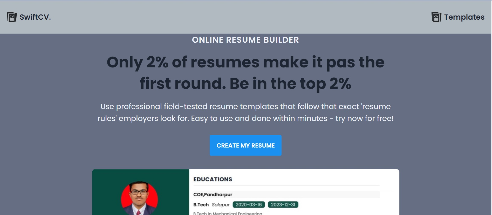
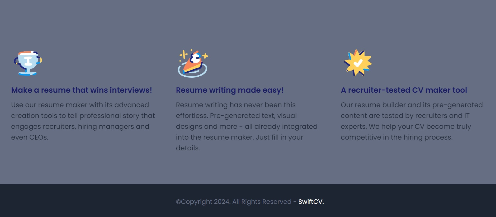
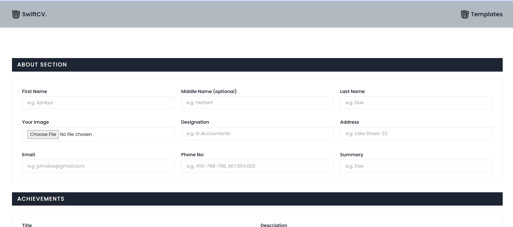
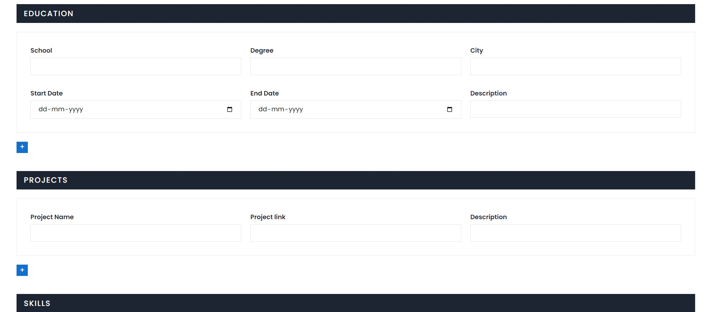
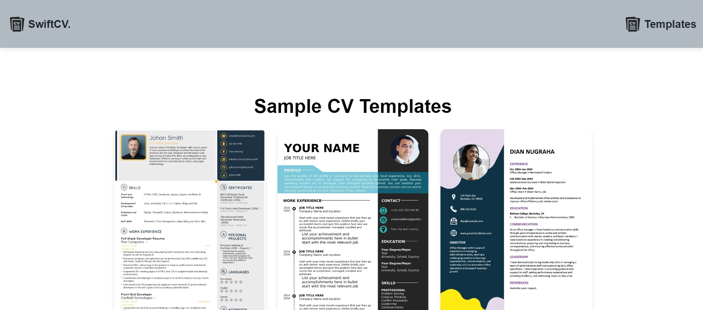

# Resume Builder Project

## Hosted Link
[SwiftCV](https://maverickcod.github.io/MCT-Resume_Generator/)



## Overview
This project is a Resume Builder web application that allows users to create professional resumes easily. It provides features such as template selection, easy editing, and printing options.

## Features
- **Easy Editing**: Edit your resume content with a user-friendly interface.
- **Print Option**: Print your resume directly from the web application.
- **Job Suggestions**: Get personalized job suggestions based on your resume content.
- **Roadmap Suggestions**: Find suggestions for improving your resume and career roadmap.

## Installation

1. Clone the repository:
    ```bash
    git clone https://github.com/MaverickCod/MCT-Resume_Generator
    ```
    

## Usage
1. Start the server:
    ```bash
    npm start
    ```
2. Open your web browser and go to `http://localhost:3000`.
3. Create your resume by selecting a template and filling in your details.
4. Once done, you can print your resume directly from the web application.

## Future Updates
In future updates, I plan to add the following features:
- Improved AI-based suggestions for resume improvement.
- Support for multiple languages in templates.
- Add Multiple Templates options to choose from.

## Screenshots









